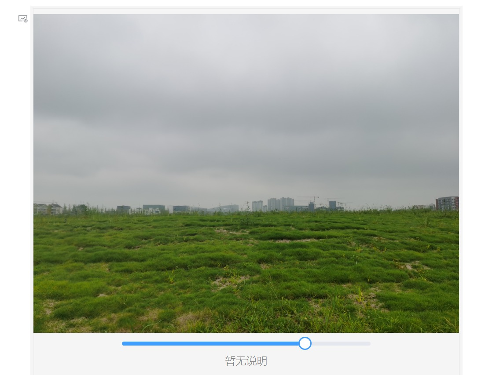

# 思源笔记相册挂件

展示 assets 文件夹内相册文件

# 实例

对于相册目录 `assets/@album/demo`

配置相册文件 `assets/demo.json` 如下：

> 配置文件的位置可以自定义

```json
{
	"root": "../../assets/@album/demo",
	"title": "",
	"date": ["2022.09.17", "2022.09.17"],
	"images": [
        {
            "file": "1.png",
            "caption": "照片说明"
        }
    ]
```

给挂件设置属性：`album=/assets/demo.json` 即可

